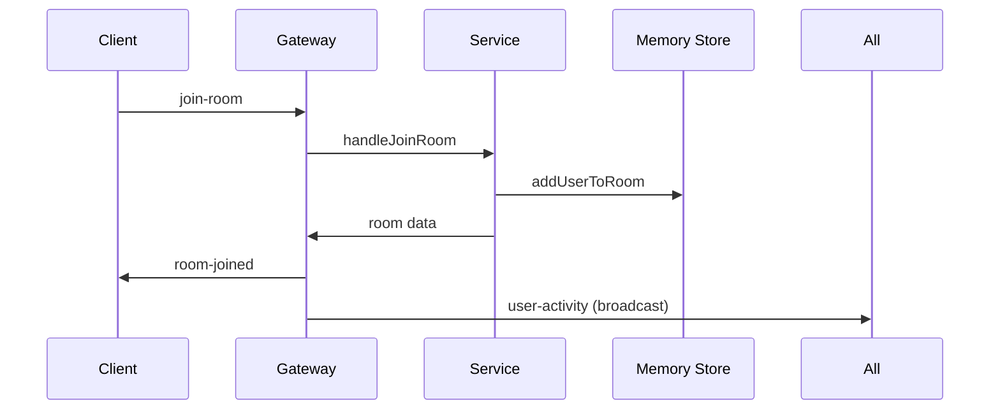

# 🚀 실시간 채팅 앱 - Backend

[](https://nestjs.com/)
[](https://www.typescriptlang.org/)
[](https://socket.io/)
[](https://nodejs.org/)

**최대 5명이 참여할 수 있는 실시간 채팅 애플리케이션의 백엔드**

NestJS와 Socket.IO를 기반으로 구축된 고성능 실시간 채팅 서버입니다. 메모리 기반 데이터 저장소를 사용하여 빠른 응답성과 자동 정리 기능을 제공합니다.

---

## ✨ 주요 기능

### 🎯 **User Stories**
- **US1**: 사용자 세션 관리 및 닉네임 설정 (랜덤 닉네임 지원)
- **US2**: Socket.IO 기반 실시간 양방향 통신
- **US3**: 채팅방 생성, 조회, 관리 API
- **US4**: 실시간 메시지 송수신 및 브로드캐스팅
- **US5**: 채팅방 참여/퇴장 관리 (최대 5명 제한)
- **US6**: 자동 정리 시스템 (30초 연결 해제 감지)

### 🔧 **기술적 특징**
- **실시간 통신**: Socket.IO 서버로 WebSocket 기반 양방향 통신
- **메모리 기반 저장소**: 빠른 응답을 위한 인메모리 데이터 관리
- **자동 정리**: 비활성 사용자/채팅방 자동 감지 및 정리
- **타입 안전성**: TypeScript 기반 완전한 타입 정의
- **확장 가능한 아키텍처**: 모듈별 분리된 클린 아키텍처
- **Frontend-First 타입 생성**: 프론트엔드 타입 자동 생성 지원

---

## 🏗️ 아키텍처

### **NestJS 모듈 구조**

```
src/
├── app.module.ts           # 루트 모듈 설정
├── app.controller.ts       # 헬스체크 및 기본 라우트
├── main.ts                 # 애플리케이션 부트스트랩
├── modules/
│   ├── chat/               # 채팅 기능 모듈
│   │   ├── chat.gateway.ts # Socket.IO 게이트웨이
│   │   ├── chat.service.ts # 채팅 비즈니스 로직
│   │   └── chat.module.ts  # 채팅 모듈 정의
│   ├── rooms/              # 채팅방 관리 모듈
│   │   ├── rooms.controller.ts # REST API 컨트롤러
│   │   ├── rooms.service.ts    # 방 관리 비즈니스 로직
│   │   └── rooms.module.ts     # 방 모듈 정의
│   └── users/              # 사용자 관리 모듈
│       ├── users.service.ts    # 사용자 관리 서비스
│       └── users.module.ts     # 사용자 모듈 정의
├── types/                  # 공용 타입 정의
│   ├── socket.types.ts     # Socket.IO 이벤트 타입
│   ├── room.types.ts       # 채팅방 관련 타입
│   ├── user.types.ts       # 사용자 관련 타입
│   └── message.types.ts    # 메시지 관련 타입
└── utils/                  # 유틸리티 함수
    ├── nickname-generator.ts # 랜덤 닉네임 생성
    └── constants.ts          # 시스템 상수
```

### **실시간 이벤트 흐름**


---

## 🚀 빠른 시작

### **사전 요구사항**
- Node.js 18+
- pnpm (권장) 또는 npm

### **설치 및 실행**

```bash
# 의존성 설치
pnpm install

# 개발 서버 시작 (Watch 모드)
pnpm start:dev

# 프로덕션 빌드
pnpm build
pnpm start:prod
```

### **스크립트**

```bash
# 개발
pnpm start:dev              # 개발 서버 (http://localhost:3001)
pnpm start                  # 일반 실행

# 빌드 및 배포
pnpm build                  # TypeScript 컴파일
pnpm start:prod             # 프로덕션 실행

# 코드 품질
pnpm lint                   # ESLint 검사
pnpm test                   # 단위 테스트
pnpm test:e2e               # E2E 테스트
pnpm test:cov               # 커버리지 포함 테스트
```

---

## 🔌 API 명세

### **REST API Endpoints**

#### **건강 상태 확인**
```http
GET /api/health
```
```json
{
  "status": "ok",
  "timestamp": "2024-01-15T10:30:00.000Z",
  "uptime": 3600.5
}
```

#### **채팅방 목록 조회**
```http
GET /api/rooms
```
```json
{
  "rooms": [
    {
      "id": "room-123",
      "name": "채팅방 1",
      "participantCount": 3,
      "maxParticipants": 5,
      "participants": ["user1", "user2", "user3"]
    }
  ]
}
```

### **Socket.IO Events**

#### **클라이언트 → 서버**
```typescript
// 로비 입장
socket.emit('join-lobby', { nickname?: string })

// 채팅방 생성
socket.emit('create-room')

// 채팅방 참여
socket.emit('join-room', { roomId: string })

// 메시지 전송
socket.emit('send-message', { roomId: string, content: string })

// 채팅방 나가기
socket.emit('leave-room', { roomId: string })
```

#### **서버 → 클라이언트**
```typescript
// 로비 업데이트
socket.on('lobby-update', (data: { rooms: RoomSummary[] }))

// 채팅방 참여 성공
socket.on('room-joined', (data: { room: RoomData }))

// 새 메시지 수신
socket.on('message-received', (data: { message: MessageData }))

// 사용자 활동 알림
socket.on('user-activity', (data: {
  type: 'joined' | 'left',
  user: UserData,
  roomId: string
}))

// 에러 발생
socket.on('error', (data: { message: string, code?: string }))
```

---

## 🛠️ 기술 스택

### **핵심 기술**
- **NestJS 10** - Node.js 프레임워크 (Express 기반)
- **TypeScript 5** - 정적 타입 검사 및 타입 안전성
- **Socket.IO 4.8** - 실시간 양방향 통신
- **Node.js 18+** - JavaScript 런타임

### **개발 도구**
- **ESLint + Prettier** - 코드 품질 및 포매팅
- **Jest** - 단위 테스트 프레임워크
- **Supertest** - E2E 테스트
- **TSC** - TypeScript 컴파일러

### **아키텍처 패턴**
- **모듈 기반 구조** - NestJS 모듈 시스템
- **의존성 주입** - IoC 컨테이너 기반 DI
- **레이어드 아키텍처** - Controller → Service → Repository 패턴
- **이벤트 기반 통신** - Socket.IO Gateway 패턴

---

## 💾 데이터 모델

### **핵심 엔티티**

#### **User Data**
```typescript
interface UserData {
  id: string                    // 고유 사용자 ID
  nickname: string              // 표시 닉네임
  socketId: string             // Socket.IO 연결 ID
  currentRoomId: string | null // 현재 참여 중인 방 ID
  isConnected: boolean         // 연결 상태
}
```

#### **Room Data**
```typescript
interface RoomData {
  id: string                   // 고유 방 ID
  name: string                 // 방 이름
  participants: UserData[]     // 참여자 목록
  messages: MessageData[]      // 메시지 히스토리
  maxParticipants: number      // 최대 참여자 수 (5명)
}
```

#### **Message Data**
```typescript
interface MessageData {
  id: string                   // 고유 메시지 ID
  content: string              // 메시지 내용
  authorId: string             // 작성자 ID
  authorNickname: string       // 작성자 닉네임
  roomId: string               // 소속 방 ID
  createdAt: string            // 생성 시간 (ISO)
  type: 'chat' | 'system' | 'notification' // 메시지 타입
}
```

---

## 🔄 자동 정리 시스템

### **사용자 연결 관리**
- **30초 비활성 감지**: 사용자가 30초 동안 응답하지 않으면 자동 연결 해제
- **방 자동 나가기**: 연결이 끊어진 사용자는 참여 중인 방에서 자동 제거
- **상태 브로드캐스팅**: 다른 사용자들에게 퇴장 알림 전송

### **채팅방 정리**
- **빈 방 삭제**: 참여자가 0명이 된 방은 즉시 삭제
- **로비 업데이트**: 방 상태 변경시 모든 로비 사용자에게 업데이트 전송
- **메모리 최적화**: 불필요한 데이터 자동 가비지 컬렉션

---

## 🧪 테스트

### **테스트 실행**
```bash
# 단위 테스트
pnpm test

# E2E 테스트
pnpm test:e2e

# 커버리지 포함 테스트
pnpm test:cov

# Watch 모드
pnpm test:watch
```

### **테스트 구조**
```
test/
├── unit/                   # 단위 테스트
│   ├── chat.service.spec.ts
│   ├── rooms.service.spec.ts
│   └── users.service.spec.ts
├── e2e/                    # E2E 테스트
│   ├── app.e2e-spec.ts
│   └── socket.e2e-spec.ts
└── fixtures/               # 테스트 데이터
    └── sample-data.ts
```

---

## 🚨 트러블슈팅

### **일반적인 문제**

1. **Socket 연결 실패**
   ```bash
   # CORS 설정 확인 (main.ts)
   # 포트 3001이 사용 가능한지 확인
   netstat -an | grep 3001
   ```

2. **메모리 사용량 증가**
   ```bash
   # 자동 정리 시스템이 작동하는지 확인
   # 로그에서 cleanup 관련 메시지 확인
   ```

3. **타입 생성 오류**
   ```bash
   # 서버가 실행 중인지 확인
   # /api/health 엔드포인트 응답 확인
   curl http://localhost:3001/api/health
   ```

### **성능 최적화**
- **메모리 사용량 모니터링**: 주기적으로 메모리 사용량 체크
- **연결 수 제한**: 동시 연결 사용자 수 모니터링
- **로그 레벨 조정**: 프로덕션에서는 ERROR 레벨만 출력

---

## 🔒 보안 고려사항

### **Socket.IO 보안**
- **CORS 설정**: 허용된 도메인만 연결 가능
- **연결 수 제한**: DoS 공격 방지
- **입력 검증**: 모든 사용자 입력에 대한 검증 및 sanitization

### **데이터 보안**
- **메모리 기반**: 영구 저장되지 않아 데이터 누출 위험 최소화
- **세션 관리**: 안전한 세션 ID 생성 및 관리
- **에러 처리**: 민감한 정보가 클라이언트에 노출되지 않도록 처리

---

## 📞 지원

프로젝트 관련 문의사항이나 버그 리포트는 GitHub Issues를 활용해주세요.

---

## 📄 라이센스

이 프로젝트는 실험용 프로젝트입니다.

---

**🔗 관련 링크**
- [Frontend Repository](../chat-fe-with-claude/) - React Frontend
- [Specification](../../specs/001-realtime-chat/spec.md) - 기능 명세서
- [Technical Plan](../../specs/001-realtime-chat/plan.md) - 기술 설계 문서